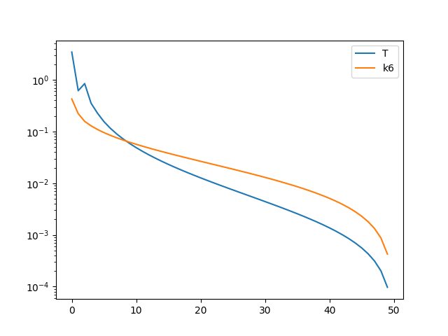
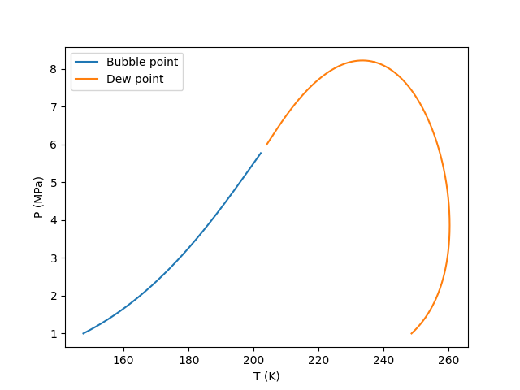
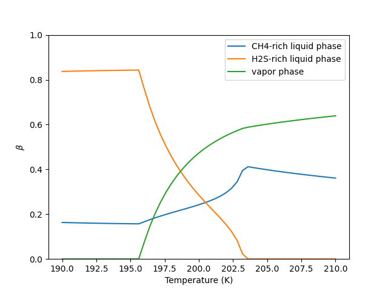
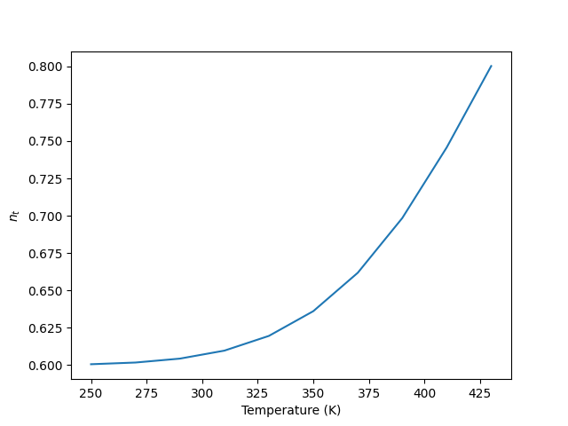
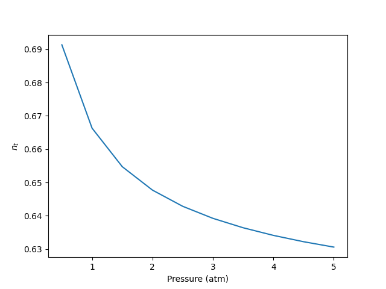

# Thermodynamic Models: Fundamentals and Computational Aspects - Exercise Report
Yifan Hao

08/25/2024

## Table of Content
- [Thermodynamic Models: Fundamentals and Computational Aspects - Exercise Report](#thermodynamic-models-fundamentals-and-computational-aspects---exercise-report)
  - [Table of Content](#table-of-content)
  - [Rachford-Rice Solver](#rachford-rice-solver)
    - [Regular Rachford-Rice algorithm](#regular-rachford-rice-algorithm)
    - [Sloppy Rachford-Rice algorithm](#sloppy-rachford-rice-algorithm)
    - [Rachford-Rice algorithm with negative-flash](#rachford-rice-algorithm-with-negative-flash)
  - [PT-flash with successive substitution](#pt-flash-with-successive-substitution)
  - [Stability analysis](#stability-analysis)
  - [Thermodynamic model consistency](#thermodynamic-model-consistency)
    - [Model 1](#model-1)
    - [Model 2](#model-2)
    - [Model 3](#model-3)
  - [Saturation points](#saturation-points)
    - [Use successive substitution to converge fugacity coefficients](#use-successive-substitution-to-converge-fugacity-coefficients)
    - [Newton algorithm to trace phase envelope](#newton-algorithm-to-trace-phase-envelope)
  - [Multiphase flash](#multiphase-flash)
    - [Q function minimization at givin fugacity coefficient](#q-function-minimization-at-givin-fugacity-coefficient)
    - [Use successive-substitution to solve fugacity coefficient as a function of composition](#use-successive-substitution-to-solve-fugacity-coefficient-as-a-function-of-composition)
    - [Stability analysis](#stability-analysis-1)
  - [Chemical reaction equilibrium](#chemical-reaction-equilibrium)
    - [Estimate $\\lambda$ values by fixed $n\_t$](#estimate-lambda-values-by-fixed-n_t)
    - [Solve reaction equilibrium using Newton method](#solve-reaction-equilibrium-using-newton-method)


## Rachford-Rice Solver

The Rachford-Rice algorithm is implemented in `RachfordRiceSolver.py` and tested in `test_day2.py`.

### Regular Rachford-Rice algorithm

| Temperature | $\beta$ |
| --- | --- |
| 190 | 0.0 |
| 195 | 0.3176 |
| 200 | 0.7712 |
| 220 | 0.9521 |
| 280 | 0.9980 |
| 300 | 1.0 |
| 350 | 1.0 |

### Sloppy Rachford-Rice algorithm

| Temperature | $\beta$ |
| --- | --- |
| 190 | 0.0 |
| 195 | 0.3505 |
| 200 | 0.9747 |
| 220 | 0.75 |
| 280 | 0.75 |
| 300 | 1.0 |
| 350 | 1.0 |

### Rachford-Rice algorithm with negative-flash

| Temperature | $\beta$ |
| --- | --- |
| 190 | -0.1792 |
| 195 | 0.3176 |
| 200 | 0.7712 |
| 220 | 0.9521 |
| 280 | 0.9980 |
| 300 | 1.0027 |
| 350 | 1.0253 |

## PT-flash with successive substitution

The governing equations for two-phase PT flash is implemented in `TwoPhaseFlash.py` utilizing the successive substitution solver from `SuccessiveSubstitutionSolver.py`. It is tested in `test_day3.py`.

The two-phase TP solver is tested with the base version, with acceleration by cycles of 5 iterations, and with acceleration by observing the $\lambda$ not changing. The number of successive substitution iteration, total Rachford-Rice iterations, and number of accelerations are printed from the output:

```
T=200.0 K; P=5.0 MPa
		original	acc by cycle	acc by change	sloppy
beta	0.828295	0.828295	0.828295	0.828293
iters	32	21	22	23
rr iters	76	55	57	37
acc_count	0	4	3	4


T=205.0 K; P=5.0 MPa
		original	acc by cycle	acc by change	sloppy
beta	0.931927	0.931928	0.931928	0.931927
iters	25	20	21	19
rr iters	64	53	56	31
acc_count	0	4	4	4


T=220.0 K; P=5.0 MPa
		original	acc by cycle	acc by change	sloppy
beta	0.978091	0.978091	0.978091	0.978091
iters	15	14	16	17
rr iters	42	41	42	27
acc_count	0	2	3	4


T=220.0 K; P=7.0 MPa
		original	acc by cycle	acc by change	sloppy
beta	0.980920	0.980920	0.980921	0.980920
iters	34	26	27	25
rr iters	84	71	73	39
acc_count	0	5	4	5


T=203.0 K; P=5.6 MPa
		original	acc by cycle	acc by change	sloppy
beta	0.804739	0.804739	0.804739	0.804738
iters	60	56	54	62
rr iters	132	126	121	84
acc_count	0	11	13	16
```
The significance of acceleration does not seem to be very big. Prof. Yan, please suggest whether this seems to be correct or maybe there's mistake in my implementation. Also, any guideline for the General Dominant Eigenvalue Method (GDEM) would be very appreciated. I looked into the original paper from Orbach and Crowe and it's not very clear how to implement a 2nd order GDEM.

There were overshooting issue during acceleration, and now I only apply acceleration when $\lambda$ is between 0.0 to 0.95. 


## Stability analysis

The stability analysis is implemented in `StabilityAnalysis.py` and tested in `test_day_4.py`.

All example conditions are tested. Using the regular initial guess from Wilson K-factors or the aggressive K-factors leads to the same converged TPD:

```
T=180.0		P=4.0
Stability analysis from vapor estimate: tm=3.3306690738754696e-16, iters=17
Stability analysis from aggressive vapor estimate: tm=6.661338147750939e-16, iters=17
Stability analysis from liquid estimate: tm=2.3314683517128287e-15, iters=19
Stability analysis from aggressive liquid estimate: tm=7.771561172376096e-16, iters=17

T=185.0		P=4.0
Stability analysis from vapor estimate: tm=0.02036082640172121, iters=9
Stability analysis from aggressive vapor estimate: tm=0.020360826401721432, iters=9
Stability analysis from liquid estimate: tm=-8.881784197001252e-16, iters=24
Stability analysis from aggressive liquid estimate: tm=-1.1102230246251565e-15, iters=22

T=190.0		P=4.0
Stability analysis from vapor estimate: tm=-0.026073706683419573, iters=6
Stability analysis from aggressive vapor estimate: tm=-0.02607370668342024, iters=6
Stability analysis from liquid estimate: tm=-2.220446049250313e-16, iters=52
Stability analysis from aggressive liquid estimate: tm=1.1102230246251565e-15, iters=51

T=203.0		P=5.5
Stability analysis from vapor estimate: tm=-0.0020181672403967177, iters=17
Stability analysis from aggressive vapor estimate: tm=-0.002018167240398272, iters=17
Stability analysis from liquid estimate: tm=-0.0639002133999107, iters=24
Stability analysis from aggressive liquid estimate: tm=-0.06390021339990981, iters=22

T=270.0		P=6.0
Stability analysis from vapor estimate: tm=5.551115123125783e-16, iters=7
Stability analysis from aggressive vapor estimate: tm=6.661338147750939e-16, iters=6
Stability analysis from liquid estimate: tm=0.20508370828400702, iters=21
Stability analysis from aggressive liquid estimate: tm=0.2050837082840088, iters=20
```

The Dominant Eigenvalue Method is tried to accelerate the successive substitution method, however, the improvement is not significant, maybe due to incorrect implementation.


## Thermodynamic model consistency

The consistency check for thermodynamic models is implemented in `ThermoModelConsistencyCheck.py` and tested in `test_day5.py`.

### Model 1

```
Testing model 1
ln_phi	dGdni
-2.5882	-2.5882
-5.8527	-5.8527
-7.4130	-7.4130
-0.6684	-0.6684
average diff = 2.2952918787844112e-08

d_xlnphi/dP	(Z-1)/P
-0.2866	-0.2866
diff = 5.55262884283092e-07
```
Both consistency checks are passed.

### Model 2

```
Testing model 2
ln_phi	dGdni
-2.3248	-2.5882
-5.7335	-5.8527
-7.6184	-7.4130
-0.8457	-0.6684
average diff = 0.1913029785326371
dG/dni test failed

d_xlnphi/dP	(Z-1)/P
-0.2866	-0.2866
diff = 5.55262884283092e-07
```
Model 2 failed the consistency check that $ln \phi_i=\partial G^{res}/RT/\partial n_i$

### Model 3

```
Testing model 3
ln_phi	dGdni
-2.5176	-2.5176
-5.7659	-5.7659
-7.3290	-7.3290
-0.6157	-0.6157
average diff = 7.688798020488719e-08

d_xlnphi/dP	(Z-1)/P
-0.2620	-0.2865
diff = 0.02448193798331111
d_xlnphi/dP test failed
```
Model 3 failed the 2nd test.

## Saturation points

Algorithms regarding saturation point calculations are implemented in `SaturationPointSolver.py`, testing programs are in `test_day6.py`.

### Use successive substitution to converge fugacity coefficients

Solving initial guess of saturation points based on Chapter 12, Eq (1) and (2) are implemented in `BubblePoint` and `DewPoint` classes. The successive substitution solver for Eq (3) is in `SaturationPointBySuccessiveSubstitution` class.

`TestSaturationPointSuccessiveSubstitution` class has multiple tests for to solve bubble point and dew point temperature and pressure. 

The table below shows how close the bubble point solver can get to the critical point:
| Pressure (MPa) | Bubble point temperature (K) | number of iterations |
| --- | --- | --- |
| 5.5 | 199.96 | 19 |
| 5.6 | 200.79 | 30 |
| 5.7 | 201.61 | 50 |
| 5.8 | 202.43 | 93 |
| 5.9 | 203.26 | 171 |
| 6.0 | 204.11 | 260 |
| 6.1 | 205.11 | 47 |

Firstly, the number of iteration increases significantly when it is close to the critical point. Secondly, this algorithm seems to be able to pass the critical point, and trace the dew point line. My suspect is $\phi^l$ and $\phi^v$ are reverted, therefore density of the calculated incipient phase become liquid density.

Here is a plot of convergence pattern of $T$ vs $K_6$, and convergence of T is 2nd order faster than $K_6$.



The algorithm is able to find the maximum dew point pressure at T=235.16K and P=8.21MPa. To calculate dew point temperature with higher pressure, the Newton algorithm is stuck with very small newton step but function value cannot be converged.

### Newton algorithm to trace phase envelope

The Newton solver for saturation point is implement in `EquilEqnsForSaturationPoint` class, and it will call the successive substitution solver first to generate the initial guess. 

`EquilEqnsForSaturationPoint.solve_phase_envolope()` tries to generate the whole phase envelope from a starting point, and based on the sensitivity to move forward. There's a manual option and also an automatic option. However, I was not able to jump through the critical point. After the critical point, if I flip the $beta$ from 0 to 1, it turns to converge to the right side of the dew point curve. The plot below was generated by calculating from two sides of the phase envelope:



## Multiphase flash

The multiphase flash algorithm is implement in `MultiPhaseRachfordRice` class in `MultiPhaseRachfordRice.py`. The testing programs are written in `TestMultiPhaseRachfordRice` class in `test_day7.py`. They are tested in `TestEquilEqns` class. 

The biggest challenges I encountered was for both successive substitution and Newton solvers, the projecting temperature or pressure will overshoot to trivial solution region, where fugacity for both phase are the same. It will lead to trivial solution (all $K$=1) for the successive substitution solver, or oscillating convergence for the Newton solver. I tried to detect the trivial solution and apply damping factor, this can guarantee the successive substitution to create a good initial guess, and Newton solver will usually converge with very small number of iterations.


### Q function minimization at givin fugacity coefficient
The Q function minimization algorithm is first implemented in `MultiPhaseRachfordRice.minimize_q()` function. The total component flow $z_i$, fugacity coefficient in each phase $\phi_i^k$, and initial guess of phase mole fractions $\beta_k$ are setup for the computation. The fugacity coefficients are calculated from Wilson K-factors by assuming vapor phase fugacity coefficients as 1. 

This algorithm is tested in `TestMultiPhaseRachfordRice.test_all_q_minimization_for_initial_guess()` for the 7 temperatures in the example. The optimized $\beta_k$, number of iterations, final gradient $g$, and objective function $Q$ values are printed from the output:
```
T=196
beta=[0.01251599 0.98748401 0.        ]
g=[0.         0.         0.10107902]
iters=5
q=0.007384749324222173


T=198
beta=[0.01251599 0.98748401 0.        ]
g=[1.11022302e-16 1.11022302e-16 5.13020350e-02]
iters=5
q=0.08003948041420383


T=200
beta=[0.01384083 0.98401086 0.00214831]
g=[0.00000000e+00 1.11022302e-16 1.11022302e-16]
iters=5
q=0.15124091112276206


T=201
beta=[0.15741053 0.61353954 0.22904993]
g=[-2.27018404e-12 -8.35553848e-13 -3.21964677e-14]
iters=4
q=0.18304988463622784


T=203
beta=[0.3265771  0.20119413 0.47222877]
g=[-1.44284584e-11 -1.44257939e-11 -8.39772696e-13]
iters=4
q=0.2333524226663093


T=204
beta=[0.38441659 0.06997996 0.54560345]
g=[1.11022302e-16 2.22044605e-16 3.33066907e-16]
iters=8
q=0.25440922467758464


T=205
beta=[0.41508525 0.         0.58491475]
g=[-1.96862526e-11  4.47503367e-03 -6.22635277e-11]
iters=4
q=0.2736899546689442
```

### Use successive-substitution to solve fugacity coefficient as a function of composition
Successive-substitution is used on top of the Q function minimization to solve the fugacity coefficient at equilibrium since it is a function of composition in each phase. The algorithm is implemented in `MultiPhaseRachfordRice.solve()` method. `TestMultiPhaseRachfordRice.test_all_ss_cases` tested the all 7 temperatures as given in the example. The output prints the final $\beta_k$, number of successive substitution iteration, and the total number of newton iterations. Successive substitution with acceleration at every 5 cycle is compared for the performance:
```
Without successive substitution acceleration
T=196
beta=[0.16600628 0.76007701 0.07391672]
ss iters=61
newton iters=128


With successive substitution acceleration
T=196
beta=[0.16600645 0.76007767 0.07391588]
ss iters=54
newton iters=113


Without successive substitution acceleration
T=198
beta=[0.20630343 0.45620026 0.33749631]
ss iters=78
newton iters=141


With successive substitution acceleration
T=198
beta=[0.20630353 0.45620047 0.337496  ]
ss iters=112
newton iters=178


Without successive substitution acceleration
T=200
beta=[0.24212842 0.28488559 0.47298599]
ss iters=123
newton iters=207


With successive substitution acceleration
T=200
beta=[0.24212842 0.28488559 0.47298599]
ss iters=123
newton iters=207


Without successive substitution acceleration
T=201
beta=[0.26410516 0.21906866 0.51682618]
ss iters=171
newton iters=273


With successive substitution acceleration
T=201
beta=[0.26410516 0.21906866 0.51682618]
ss iters=171
newton iters=273


Without successive substitution acceleration
T=203
beta=[0.36565555 0.05647057 0.57787388]
ss iters=536
newton iters=708


With successive substitution acceleration
T=203
beta=[0.36565555 0.05647058 0.57787388]
ss iters=505
newton iters=646


Without successive substitution acceleration
T=204
beta=[0.40777207 0.         0.59222793]
ss iters=671
newton iters=111


With successive substitution acceleration
T=204
beta=[0.40777207 0.         0.59222793]
ss iters=659
newton iters=111


Without successive substitution acceleration
T=205
beta=[0.39826688 0.         0.60173312]
ss iters=387
newton iters=90


With successive substitution acceleration
T=205
beta=[0.39826688 0.         0.60173312]
ss iters=358
newton iters=146

```

To identify the temperature range of the 3-phase region, `TestMultiPhaseRachfordRice.test_ss_to_find_3_phase_t_range` runs a temperature survey from 190K to 210K. The 3-phase temperature range is 195.64-203.3K:



### Stability analysis

Stability analysis is tested in `TestMultiPhaseRachfordRice.test_stability` for the 7 example temperatures. It uses the `StabilityAnalysis` class from previous exercise. It can be incorporated in multiphase equilibrium solver to test the results when certain phase is excluded at the end. A good initial guess regarding the missing phase is needed along with some administrative code. It't not implemented here.

Tangent plane distance from different phase composition guess
| Temperature (K) | pure CH4 liquid | pure H2S liquid | ideal gas|
| --- | --- | --- | --- |
| 196 | -0.00064 | -0.06868 | -8.88178e-16 |
| 198 | -0.02263 | -0.06284 | 2.220446e-16 |
| 200 | -0.04443 | -0.05776 | 8.881784e-16 |
| 201 | -0.05522 | -0.05550 | -0.05522 |
| 203 | -0.07652 | -0.05157 | -0.07653 |
| 204 | -0.08701 | -0.04990 | -0.08701 |
| 205 | -0.09735 | -0.04843 | -0.09735 |


## Chemical reaction equilibrium
The algorithm to calculate reaction equilibrium is implemented in `ReactionSystem.py`. Taking apparent components as input, it first constructs a list of element balance group; based on the apparent components type as monomer or inert, it creates a list of true component by considering the dimers of self- and cross-association. It also creates the $A_{ij}$ , which is the stoichiometry matrix of the true components and element groups.

The other input is the reaction equilibrium constant coefficients of self-association dimerization reactions.  It 
generates the function to calculate equilibrium constant and dimer chemical potentials.

### Estimate $\lambda$ values by fixed $n_t$
The first algorithm implemented in this class is `ReactionSystem.estimate_lambdas_by_fixing_nt(nt, lambdas)`, this function can be called after temperature, pressure, and apparent component molar flow are setup. It takes inputs of the fixed total moles of true components, and the initial guess of the $\lambda$ values. The algorithm to minimize $Q$ function is implemented here. 

Test of this function is in `TestReactionSystem.test_solve_lambdas_and_nt()` in `test_day9.py`. In the test, $T=360 K$ and $P=2 atm$ is setup to duplicate results at the end. The printed output:
```
estimated lambdas=[-2.99465699 -3.53831473 -3.53284552 -3.58288624 -1.32175584] in 9 iterations
```
`TestReactionSystem.test_different_lambdas()` can be used to test different initial guess of $\lambda$s for the optional questions. Here lists a few of the different initial guesses and their impact on the convergence:

|$\lambda_1-\lambda_5$|number of iterations|
|---|---|
|-100|NA|
|-10|7|
|-5|6|
|-1|9|
|0|11|
|1|13|
|5|21|
|10|31|
|100|NA|

Overall, negative initial values for $\lambda$s takes less iterations to converge, and once they converge, the final estimated $\lambda$ values are the same. When the initial guesses are too big or too small, the algorithm failed to converge, either due to invalid math operation of `exp` on very large number, or the compositions calculated from such initial guesses are too small, and the hessian matrix is very ill-conditioned to move the Newton method.

### Solve reaction equilibrium using Newton method
The final Newton solver is implemented in `ReactionSystem.solve(t, p, zi, initial_nt, initial_lambdas)`. It calls `ReactionSystem.estimate_lambdas_by_fixing_nt(nt, lambdas)` first to estimate the $\lambda$ values. 
`TestReactionSystem.test_solve_lambdas_and_nt()` tested this algorithm using the same condition to duplicate the final results:
```
estimated lambdas=[-2.99465699 -3.53831473 -3.53284552 -3.58288624 -1.32175584] in 9 iterations
Newton solver converged in 3 iterations
xi:
{
  "A": 0.054371920681348475,
  "B": 0.031381252101277256,
  "C": 0.031554781288397886,
  "D": 0.030002460519717545,
  "I": 0.30878159806224936,
  "AA": 0.029749647635936863,
  "AB": 0.06487616844590846,
  "AC": 0.06483558483141763,
  "AD": 0.06519862916237511,
  "BB": 0.035369471293650055,
  "BC": 0.07069469148486564,
  "BD": 0.07109054365523017,
  "CC": 0.03532523403196577,
  "CD": 0.07104607260697371,
  "DD": 0.035721946161120004
}
nt=0.6477069813958342
```

This algorithm can be tested in more conditions in `TestReactionSystem.test_different_lambdas()`. At different conditions, the Newton solver is robust enough to converge within 3-4 iterations, which comes from the estimation method for $\lambda$s.




This plot shows the moles of true components increases with temperature, which means higher temperature decompose the dimers to the monomers.



On the other hand, higher pressure decrease the total moles of true components, indicating the promotion of dimerization according to the Le Chatelier's principle.